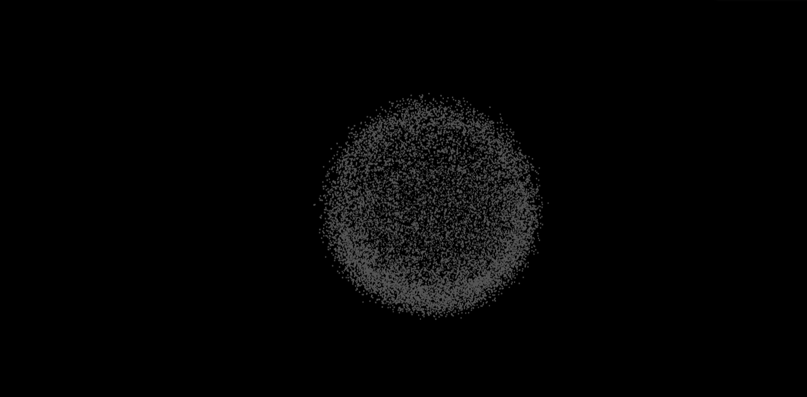

## 🌟 Proje Tanıtımı ~ Three.js Toz Küresi Animasyonu

Bu proje, Three.js kullanarak interaktif bir 3D toz küresi animasyonu oluşturur. Başlangıçta dağınık olarak görüntülenen parçacıklar, zaman içinde birleşerek düzensiz bir taş/küre benzeri yapı oluşturur. Kullanıcı fare ile yapıyı döndürebilir ve sayfa kaydırma ile parçacıkların hareketini etkileyebilir.

<a href="https://youtu.be/hGS7ElkIqBM" title="Yönetim Paneli Tanıtım Videosu">
      <br>
    <b>▶️ Tanıtım Videosunu izlemek için lütfen tıklayınız!</b>
  </a>

## 📋 İçindekiler

- [Kurulum](#kurulum)
- [Proje Yapısı](#proje-yapısı)
- [Kodun Detaylı Açıklaması](#kodun-detaylı-açıklaması)
- [Etkileşim Özellikleri](#etkileşim-özellikleri)
- [Geliştirme İpuçları](#geliştirme-ipuçları)
- [Kaynaklar](#kaynaklar)
- [İletişim](#iletişim)
- [Lisans](#lisans)

## 🔧 Kurulum

1. Projeyi GitHub'dan klonlayın:

   ```bash
   git clone https://github.com/mehmetdogandev/3D-Animation-with-Three-JS.git
   ```

2. Projeyi indirdikten sonra, klasörü açın ve `index.html` dosyasını herhangi bir modern web tarayıcısı ile açmanız yeterlidir (Chrome, Firefox, Edge vb.)

3. Başka bir kurulum veya yapılandırma gerekmez, bütün gerekli kütüphaneler CDN üzerinden otomatik olarak yüklenmektedir.

## 📁 Proje Yapısı

Proje aşağıdaki dosyalardan oluşmaktadır:

- `index.html`: Ana HTML yapısı ve gerekli script referansları
- `style.css`: Temel stil tanımlamaları
- `script.js`: Three.js ile 3D toz küresi animasyonu oluşturan ana kod

## 🔍 Kodun Detaylı Açıklaması

### 1. Sahne Oluşturma

Script.js dosyası Three.js sahnesinin kurulumu ile başlar. Öncelikle temel Three.js bileşenlerini oluşturuyoruz:

```javascript
const scene = new THREE.Scene();
const camera = new THREE.PerspectiveCamera(
  75,
  window.innerWidth / window.innerHeight,
  0.1,
  1000
);
const renderer = new THREE.WebGLRenderer({ antialias: true });
```

### 2. Parçacık Sistemi

Projenin kalbi, bir parçacık sistemidir. Yaklaşık 16.000 parçacık kullanarak taş benzeri bir form oluşturuyoruz:

```javascript
const particlesCount = 15999;
const particlesGeometry = new THREE.BufferGeometry();
```

Her parçacık için 3D uzayda bir konum ve hareket hızı tanımlanır. Parçacıklar önce rastgele dağıtılır, ardından animasyon sırasında küresel formda bir araya gelir.

### 3. Animasyon Sistemi

`formationAnimation()` fonksiyonu, dağınık parçacıkların düzenli bir küre formuna geçişini sağlar:

```javascript
function formationAnimation() {
  if (animationProgress < 1) {
    animationProgress += 0.01;

    for (let i = 0; i < particlesCount; i++) {
      positions[i * 3] += (originalPositions[i * 3] - positions[i * 3]) * 0.05;
      // ... diğer pozisyon güncellemeleri
    }

    particlesGeometry.attributes.position.needsUpdate = true;
    requestAnimationFrame(formationAnimation);
  }
}
```

### 4. Etkileşim Kontrolü

Kullanıcı etkileşimi için fare olayları dinlenir ve OrbitControls ile 3D nesneler üzerinde kontrol sağlanır:

```javascript
const controls = new THREE.OrbitControls(camera, renderer.domElement);
controls.enableDamping = true;
// ... diğer ayarlar
```

### 5. Duyarlı Tasarım

Tarayıcı boyutu değişikliklerine göre canvasin boyutları otomatik olarak güncellenir:

```javascript
window.addEventListener("resize", () => {
  renderer.setSize(window.innerWidth, window.innerHeight);
  camera.aspect = window.innerWidth / window.innerHeight;
  camera.updateProjectionMatrix();
});
```

## 🖱️ Etkileşim Özellikleri

- **Fare ile Döndürme**: Fare ile tıklayıp sürükleyerek 3D küreyi döndürebilirsiniz
- **Kaydırma Etkisi**: Sayfayı aşağı kaydırdıkça parçacıkların hareketi değişir
- **Yakınlaştırma**: Fare tekerleği ile yakınlaştırma/uzaklaştırma yapabilirsiniz (OrbitControls sayesinde)

## 💡 Geliştirme İpuçları

Three.js öğrenmeye çalışırken en çok uğraştığım kısımlardan biri parçacık sistemlerini oluşturmak ve animasyonları düzgün bir şekilde çalıştırmaktı. Bu projeyi geliştirirken karşılaştığım bazı zorluklar ve çözümleri:

1. **Performans Optimizasyonu**: Binlerce parçacık kullanırken performans sorunları yaşayabilirsiniz. BufferGeometry kullanmak ve sadece değişen nitelikleri güncellemek (needsUpdate = true) performansı artırır.

2. **Shader Kullanımı**: Daha karmaşık görsel efektler için GLSL shader'ları öğrenmek çok faydalı olacaktır.

3. **Etkileşim Tasarımı**: Kullanıcı deneyimini iyileştirmek için çeşitli etkileşim modelleri deneyebilirsiniz.

## 📚 Kaynaklar

Three.js öğrenmeye başlıyorsanız, aşağıdaki kaynaklar size yardımcı olabilir:

- [Three.js Resmi Dokümantasyon](https://threejs.org/docs/)
- [Three.js Örnekler](https://threejs.org/examples/)
- [Bruno Simon'un Three.js Journey Kursu](https://threejs-journey.com/)

## 📞 İletişim

Mehmet DOĞAN - mehmetdogan.dev@gmail.com

Proje Bağlantısı: https://github.com/mehmetdogandev/imagecription

### Sosyal Medya & Web

- **Website**: memetdogan.com
- **LinkedIn**: linkedin.com/in/mehmetdogandev
- **YouTube**: youtube.com/@md-kare

## 📄 Lisans

Bu proje MIT Lisansı altında lisanslanmıştır. Detaylar için `LICENSE` dosyasına bakınız.

---

Bu proje, Three.js'in temel özelliklerini anlamak ve 3D web grafikleri konusunda deneyim kazanmak için harika bir başlangıçtır. Kodu inceleyip değiştirerek kendi 3D projelerinizi oluşturmaya başlayabilirsiniz.

Herhangi bir soru veya sorun yaşarsanız, GitHub üzerinden iletişime geçebilirsiniz.

🚀 İyi kodlamalar!
